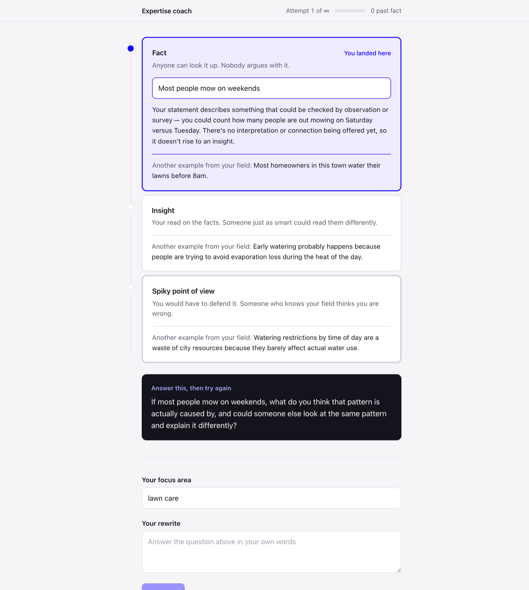

# expertise-coach

**Live: https://expertise-coach.vercel.app**



Students building a knowledge graph confuse an insight with a spiky point of view.
This coaches the difference. You enter a focus area and something you believe about
it; the app tells you which of three levels it actually landed in, shows a worked
example of all three from elsewhere in your field, and asks you one question. It
never writes the statement for you. Rewrite, resubmit, repeat.

Where it sits: one screen of the Expertise App. A graded entry here is what should
feed the Audience App's umbrella topics.

Built in about two hours, including the model benchmark below.

## Run it

```bash
npm install
echo 'ANTHROPIC_API_KEY=sk-ant-...' > .env.local
npm run dev
```

Open http://localhost:3000. `npm run build` for the production build.

## How it works

Next.js 14 App Router, TypeScript, Tailwind. No database — attempt history is React
state and resets on reload.

The key is read only inside `app/api/diagnose/route.ts`, the single server route. It
sends the system prompt in `lib/system-prompt.ts`, which forbids rewriting the
student's statement, and pins the response shape with structured outputs against the
Zod schema in `lib/diagnosis.ts` — so the route returns a valid diagnosis or an
error, never half-parsed text.

Two decisions carry the whole thing:

Worked examples must be about a **different subject** than the student's statement.
Left unconstrained, the model illustrates the three levels by rewriting the student's
own claim one rung up, which hands them the answer.

The three level definitions are **hardcoded**, not model-generated. They are the
thing being taught, so they must not drift between attempts.

## Model choice

Benchmarked over labelled cases where the correct level is known, on this prompt:

| Model | Thinking | Accuracy | Median | Max |
|---|---|---|---|---|
| **claude-sonnet-5** | **off** | **15/15** | **5.5s** | **7.0s** |
| claude-sonnet-5 | adaptive, low | 14/15 | 5.8s | 9.1s |
| claude-opus-5 | adaptive, low | 5/6 | 8.3s | 10.7s |
| claude-opus-5 | adaptive, medium | 5/6 | 9.9s | 10.9s |
| claude-sonnet-4-6 | off | 4/6 | 9.2s | 11.3s |

Sonnet 5 with thinking off wins on both axes. Opus 5 matched it on accuracy and cost
~4s per call, which is the difference between a demo that feels instant and one that
looks broken. Sonnet 4.6 was the worst option tested — slower *and* the only model to
misread a causal reading as a position, which is exactly the distinction being taught.

Thinking has to be disabled explicitly. Omitting the parameter runs adaptive on
Sonnet 5.

Prototype by David Kelly.
